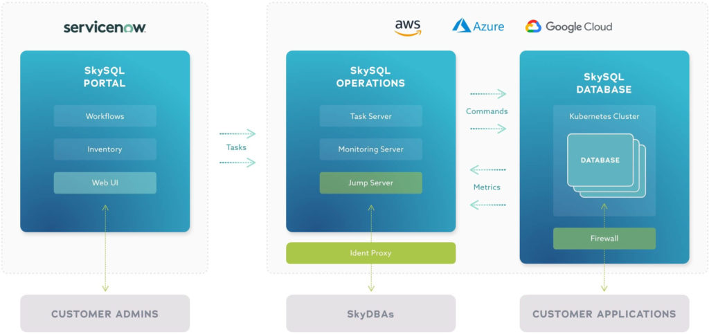

# TODO

**TODO** is a web application that introduces you to the power, performance, and simplicity of [MariaDB](https://mariadb.com/products/).

<p align="center" spacing="10">
    <kbd>
        
    </kbd>
</p>

This README will walk you through the steps for getting the TODO web application up and running using MariaDB. To ensure success, please follow the instructions in order.

**Note:** The code provided within this repository is completely open source. Please feel free to use it as you see fit.

# Table of Contents
1. [Requirements](#requirements)
2. [Introduction to MariaDB](#introduction)
    1. [MariaDB Platform](#platform)
    2. [MariaDB SkySQL](#skysql)
3. [Getting started](#get-started)
    1. [Get the code](#code)
    2. [Create the schema](#schema)
    3. [Anatomy of the app](#app)
    4. [Build and run the app](#build-run)
4. [Requirements to run the app](#requirements)
5. [Support and contribution](#support-contribution)
6. [License](#license)

## Requirements <a name="requirements"></a>

This sample application, no matter which API project you target, will requires the following to be installed/enabled on your machine:

* [MariaDB Client](https://mariadb.com/products/skysql/docs/clients/), used to connect to MariaDB instances.

## Introduction to MariaDB <a name="introduction"></a>

### MariaDB Platform <a name="platform"></a>

[MariaDB Platform](https://mariadb.com/products/mariadb-platform/) integrates [transactional](https://mariadb.com/products/mariadb-platform-transactional/) and [analytical](https://mariadb.com/products/mariadb-platform-analytical/) products so developers can build modern applications by enriching transactions with real-time analytics and historical data, creating insightful experiences and compelling opportunities for customers – and for businesses, endless ways to monetize data. 

<p align="center" spacing="10">
    <kbd>
        
    </kbd>
</p>

To get started using MariaDB locally you can choose one of the following options:

* [Download and install MariaDB (Community or Enterprise) directly from mariadb.com](https://mariadb.com/docs/deploy/installation/) 

* [Download and install MariaDB using the official MariaDB Community Server 10.5 Docker Image available at hub.docker.com](https://hub.docker.com/r/mariadb/columnstore)

### MariaDB SkySQL <a name="skysql">

[SkySQL](https://mariadb.com/products/skysql/) is the first and only database-as-a-service (DBaaS) to bring the full power of MariaDB Platform to the cloud, including its support for transactional, analytical and hybrid workloads. Built on Kubernetes, and optimized for cloud infrastructure and services, SkySQL combines ease of use and self-service with enterprise reliability and world-class support – everything needed to safely run mission-critical databases in the cloud, and with enterprise governance.

[Get started with SkySQL!](https://mariadb.com/products/skysql/#get-started)

<p align="center" spacing="10">
    <kbd>
        
    </kbd>
</p>

## Get started <a name="get-started"></a>

In order to run the TODO application you will need to have a MariaDB instance to connect to. For more information please check out "[Get Started with MariaDB](https://mariadb.com/get-started-with-mariadb/)".

### Get the code <a name="code"></a>

Download this code directly or use [git](git-scm.org) (through CLI or a client) to retrieve the code using `git clone`:

```
$ git clone https://github.com/mariadb-corporation/dev-example-todo.git
```

### Create the schema <a name="schema"></a>

[Connect to the database](https://mariadb.com/kb/en/connecting-to-mariadb/) and execute the following SQL scripts:

```sql
CREATE DATABASE todo;

CREATE TABLE todo.tasks (
  id INT(11) unsigned NOT NULL AUTO_INCREMENT,
  description VARCHAR(500) NOT NULL,
  completed BOOLEAN NOT NULL DEFAULT 0,
  PRIMARY KEY (id)
);
```

### Anatomy of the app <a name="app"></a>

This application is made of two parts:

* Client
    - communicates with the API.
    - is a React.js project located in the [client](client) folder.
* API
    - uses a MariaDB Connector to connect to MariaDB.
    - contains multiple projects, located in the [api](api) folder.
        - [Node.js](api/nodejs)
        - [JDBC](api/jdbc)
        - [Python](api/python)
        - [R2DBC](api/r2dbc)

See the README's in [client](client/README.md) and [api](api/README.md) for more information on how to get started!

### Build and run the app <a name="build-run"></a>

1. Navigate to the [client](client) folder and execute the following CLI command to install the package dependencies for the React.js application.

```bash
$ npm install
```

2. Pick an [API](api) project and follow the instructions of the README to build and run the API project.

3. Navigate to the [client](client) folder and execute the following CLI command to start the React.js application.

```bash 
$ npm start
``` 

## Support and Contribution <a name="support-contribution"></a>

Thanks so much for taking a look at the TODO app! As this is a very simple example, there's plenty of potential for customization. Please feel free to submit PR's to the project to include your modifications!

If you have any questions, comments, or would like to contribute to this or future projects like this please reach out to us directly at [developers@mariadb.com](mailto:developers@mariadb.com) or on [Twitter](https://twitter.com/mariadb).

## License <a name="license"></a>
[](https://opensource.org/licenses/MIT)
